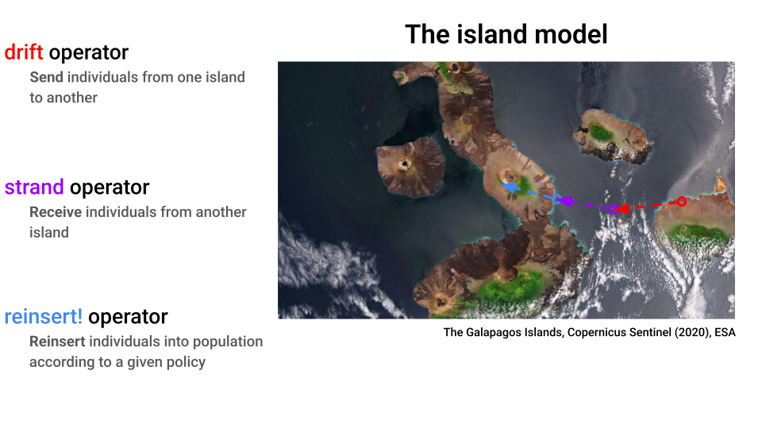

# Island Models using MPI

!!! note
    This is a somewhat advanced topic. If you are new to parallel computing, we recommend reading the page on [Parallelism](../tuto/parallel.md) first.

EvoLP has newly implemented support for island models of evolutionary algorithms as an extension.
The extension, EvoLPIslands, is implemented using the [weak dependency](https://pkgdocs.julialang.org/v1/creating-packages/#Weak-dependencies) feature added to Julia in v1.9.

!!! details "Loading the extension"
    EvoLPIslands will be activated if and only if you have both `EvoLP` and `MPI` loaded into your current scope via the `using` or `import` keywords.

## About Island Models

In an island model, multiple populations (or _islands_) evolve concurrently, and a subpopulation (or _deme_) occasionally drifts from one island to another in a process called _migration_.
Migration passively helps with diversity preservation, which in turn benefits the exploration of large search spaces.

### Migration

The migration process is broken down in three steps: `drift`, `strand` and `reinsert!`:



To implement these operators, EvoLP uses [MPI.jl](https://juliaparallel.org/MPI.jl/stable/), a wrapper of MPI for Julia.
MPI is a communication standard available in many parallel computing architectures, most notably High Performance Computing clusters, but it can also be used in your local machine.

Specifically, EvoLP uses the `Send` and `Receive` MPI directives, which are **blocking**.
However, there is no need to use these directly. Instead, using the `drift`, `strand`, and `reinsert!` operators in your algorithms should suffice.

```@docs
drift
strand
reinsert!
```

## Selecting a Deme

To send, receive, and reinsert a deme, we introduced `DemeSelector`s that allow for two different types of selection: random, and worst.

```@docs
RandomDemeSelector
WorstDemeSelector
```

As with other operators in EvoLP, the deme selectors can be passed to the `select` method—both for selecting the deme that will _migrate_ as well as selecting the deme that will be replaced.

```@docs
select(::RandomDemeSelector, y)
select(::WorstDemeSelector, y)
```

We also provide a built-in toy algorithm, the island GA:

```@docs
islandGA!
```

## Further Reading

- Our paper [Evolutionary Computation with Islands: Extending EvoLP.jl for Parallel Computing](https://www.ntnu.no/ojs/index.php/nikt/article/view/5667).
- EvoLP's [Parallel](../tuto/parallel.md) documentation page.
- The [MPI.jl documentation](https://juliaparallel.org/MPI.jl/stable/).
